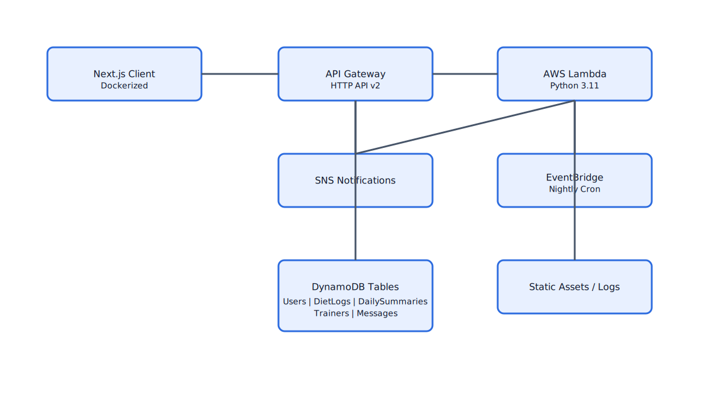

# Diet Logging

Diet Logging is a collaborative nutrition-tracking platform that helps clients and trainers stay aligned on daily intake, goals, and progress. The app provides intuitive dashboards, real-time chat, and structured meal logging to keep every plan on track.

## System Design & Architecture

### High-level diagram

### Core components
- **Client app (Next.js + React 19, Dockerized)** – Serves the dual onboarding flow, macro dashboards, food search, and trainer chat experiences. The image is built as a container so it runs consistently in local, staging, or production with the same environment variables and runtime.

- **API layer (AWS API Gateway HTTP API v2)** – Public HTTPS entry point that handles CORS for the Next.js origin and forwards requests to the compute layer with a lightweight proxy integration. Paths map cleanly to domain modules (users, trainers, diet logs, chat, foods, summaries).

- **Compute (AWS Lambda, Python 3.11)** – Stateless handlers validate inputs, enforce auth, and orchestrate domain logic. A primary Lambda serves request traffic, while a scheduled Lambda builds daily summaries so trainers see up-to-date totals each morning.

- **Data layer (Amazon DynamoDB)** – PAY_PER_REQUEST tables segment each concern: Users, DietLogs (userId + timestamp sort key), DailySummaries (userId + date), Foods, Trainers, TrainerAssignments (userId + trainerId), and Messages (conversationId + timestamp). This keeps reads/writes isolated and horizontally scalable.

- **Notifications (Amazon SNS)** – Publishes trainer alerts for assignments, new chats, and summary availability. Lambda pushes structured messages to SNS, letting subscribers (email, SMS, future webhooks) fan out without code changes.

- **Scheduled workflows (Amazon EventBridge)** – Nightly cron triggers the summary Lambda, which aggregates the prior day’s logs into trainer-facing rollups so dashboards start the day fresh.

- **Infra-as-code (Terraform)** – Manages IAM roles, permissions, API Gateway, Lambdas, DynamoDB tables, SNS topics, and EventBridge rules. The stack can be recreated or promoted between environments using the same definitions.

### Request flow (example: log a meal)
1. Client calls `POST /diet-logs` from the Next.js app.
2. API Gateway forwards the request to the Lambda handler using the proxy integration.
3. `handler.py` parses and validates the payload, then delegates to the diet log module.
4. The diet log module writes the entry to the `DietLogs` DynamoDB table via the shared DynamoDB client.
5. Lambda returns a structured JSON response that the frontend renders in the meal dashboard.

### How the system runs day to day
- **Onboarding and stateful UX** – The containerized frontend serves static assets plus API calls. Users pick a role, and the app stores session context while calling the proper API routes for client or trainer capabilities.
- **Trainer collaboration** – Chat messages post through the same API Gateway + Lambda path and land in the Messages table. SNS can emit notifications so trainers see timely updates.
- **Daily rollups** – EventBridge fires a nightly rule to invoke the summary Lambda. It scans the prior day’s DietLogs per user, writes DailySummaries, and notifies trainers so dashboards stay fresh each morning.
- **Observability and resiliency** – API Gateway and Lambda emit structured logs; DynamoDB tables are isolated by access patterns, reducing noisy-neighbor effects; Terraform pins IAM permissions so Lambdas only reach the resources they need.

### Tech Stack
- **Frontend:** Next.js 16, React 19, Material UI, Tailwind CSS 4, TypeScript; containerized with Docker for consistent local and cloud deployments.
- **Backend:** Python 3.11 AWS Lambda functions, modularized into user, trainer, diet log, food search, summary, and chat handlers.
- **Data & Messaging:** DynamoDB tables for core entities; SNS topic for trainer notifications; EventBridge scheduled rules for nightly jobs.
- **Infrastructure:** Terraform for AWS resources (IAM, API Gateway HTTP API v2, Lambdas, DynamoDB, SNS, EventBridge).

### How the pieces fit together
- The Dockerized Next.js frontend serves the client and trainer experiences and calls the API Gateway endpoints with authenticated requests.
- API Gateway performs lightweight request handling and forwards payloads to the main Lambda using the proxy integration.
- The Lambda entrypoint validates inputs, dispatches to the appropriate domain module (users, diet logs, trainers, chat, foods, summaries), and interacts with DynamoDB tables for durable storage.
- SNS notifies trainers on key events (assignments, new messages, daily summaries), while EventBridge triggers the scheduled Lambda to roll up daily intake.
- Terraform templates define and wire the API, Lambdas, permissions, tables, and messaging so environments stay in sync.

## Features
- **Dual-entry experience** for clients and trainers with role-based onboarding from the landing screen.
- **Macro-aware dashboards** showing calories and a detailed macro breakdown for the day.
- **Meal organization** by time of day (Breakfast, Lunch, Dinner, Snack) with quick logging workflows for common foods.
- **Trainer/client collaboration** via real-time chat embedded alongside nutrition data.
- **Searchable food logging** to quickly find items and add them with quantities.

## Screenshots
- Landing page role selection

  

- Client overview with chat and daily macros

  

- Daily dashboard with searchable meals

  

- Quick food logging modal

  

## Getting Started
1. **Frontend (Dockerized)**
   - From the repo root, build the image: `docker build -t diet-logging-frontend ./frontend`.
   - Run it: `docker run -p 3000:3000 diet-logging-frontend` (serves on http://localhost:3000).

2. **Frontend (local dev)**
   - Navigate to `frontend`.
   - Install dependencies: `npm install`.
   - Run the development server: `npm run dev` (defaults to http://localhost:3000).

3. **Project structure**
   - `frontend/`: Next.js app for client and trainer experiences (Dockerfile included for containerized deploys).
   - `backend/`: Backend code and lambda assets for API handling.
   - `pics/`: UI reference screenshots.

## Roadmap Ideas
- Expand food database and search relevance.
- Add progress analytics with historical charts.
- Support custom macro targets and reminders.
- Offer export/share options for diet plans.

## License
This project is provided for demonstration purposes. Check repository details for licensing information.
